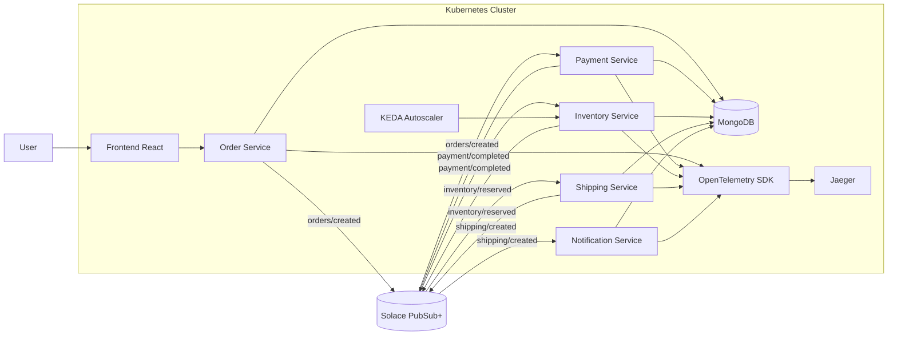

Event-driven microservices platform running on Kubernetes using Solace PubSub+ for asynchronous communication. Services are autoscaled with KEDA based on Solace queue depth, persisted in MongoDB, and monitored using OpenTelemetry and Jaeger for distributed tracing and observability.

